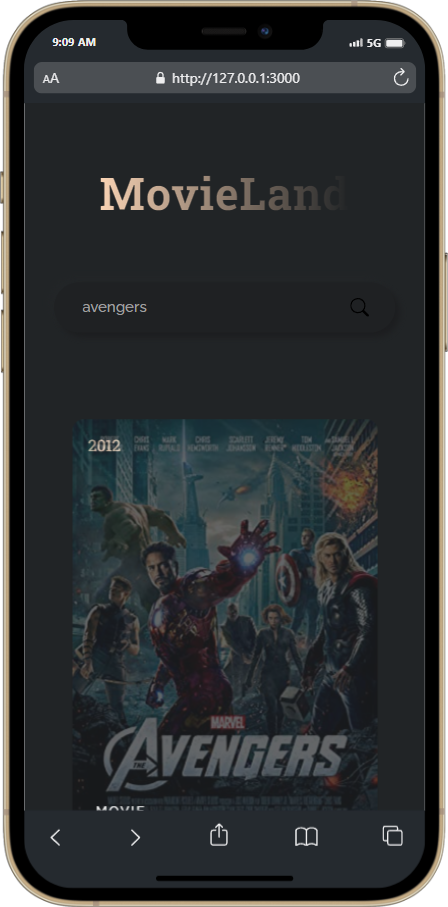

# MovieHub

MovieHub is a React web application that allows users to search for movies. It utilizes the OMDB API to fetch movie data based on user input.

## Features

- Search for movies by typing in the search bar.
- Real-time search results as you type.
- Responsive design for a seamless experience on different devices.

## Tech Stack
MovieHub is built using the following technologies:
- [React.js](https://react.dev/)
- [Node.js](https://nodejs.org)
- [HTML](https://www.w3schools.com/html/) & [CSS](https://www.w3schools.com/css/)
- [OMDB API](http://www.omdbapi.com): The Open Movie Database API used for fetching movie data.

## Tools
To set up and run MovieHub locally, you will need the following tools:
- Code Editor: [Visual Studio Code](https://code.visualstudio.com)
- [Git](https://git-scm.com/downloads)

## Installation
1. Clone the repository:
   ```
   https://github.com/RazinSyakib43/MovieHub.git
   ```
2. Navigate to the project directory:
3. Install the dependencies:
   ```
   npm install
   ```
4. Obtain an API key from OMDB API (http://www.omdbapi.com/) by signing up for an account.
5. Add your API key on App.jsx on line 7
   ```
   const API_URL = "http://www.omdbapi.com?apikey=YOUR_KEY";
   ```
6. Build and Start the application:
   ```
   npm run build
   npm run dev
   ```
7. Open your browser and visit `http://localhost:3000` or `http://127.0.0.1:3000/` to view the MovieHub application.
8. Type in the search bar to search for movies. The search results will be displayed dynamically as you type.
9. Enjoy exploring and discovering movies with MovieHub!
 
## Screenshots
<p>
  
  
</p>

## Contributing
Contributions are welcome! If you have any suggestions or find any issues, please feel free to submit a pull request or create an issue in this repository.

##
<b>&copy; Razin 2023</b>